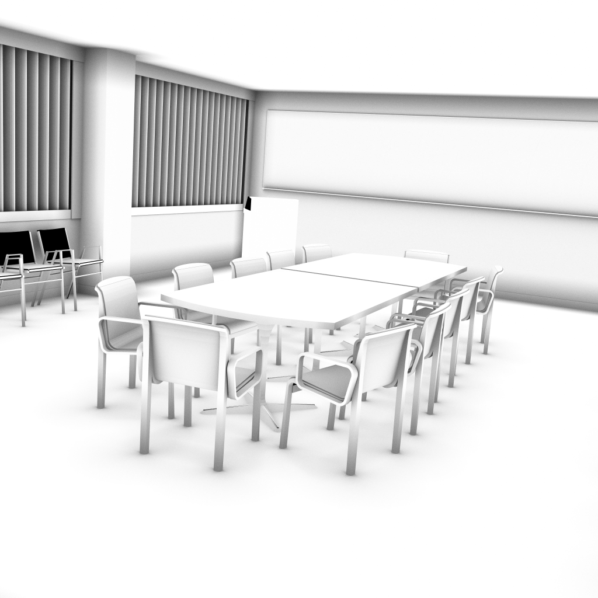

## Ambient Occlusion Benchmark

For our paper "Visionaray: A Cross-Platform Ray Tracing Template Library", we reported results gathered with our simple AO benchmark program implemented with Visionaray. Going to update the results from time to time here for new hardware platforms.

<table border="0">
  <tr>
    <td></td>
    <td>
      
    </td>
    <td>
      
    </td>
    <td>
      
    </td>
  </tr>
  <tr>
    <td>Platform</td>
    <td>Conference Room</td>
    <td>Fairy Forest</td>
    <td>Sibenik Cathedral</td>
  </tr>
  <tr>
    <td>Raspberry PI3 with ARM NEON</td>
    <td>2.0 (2.3)</td>
    <td>1.2 (1.3)</td>
    <td>1.7 (1.9)</td>
  </tr>
</table>
