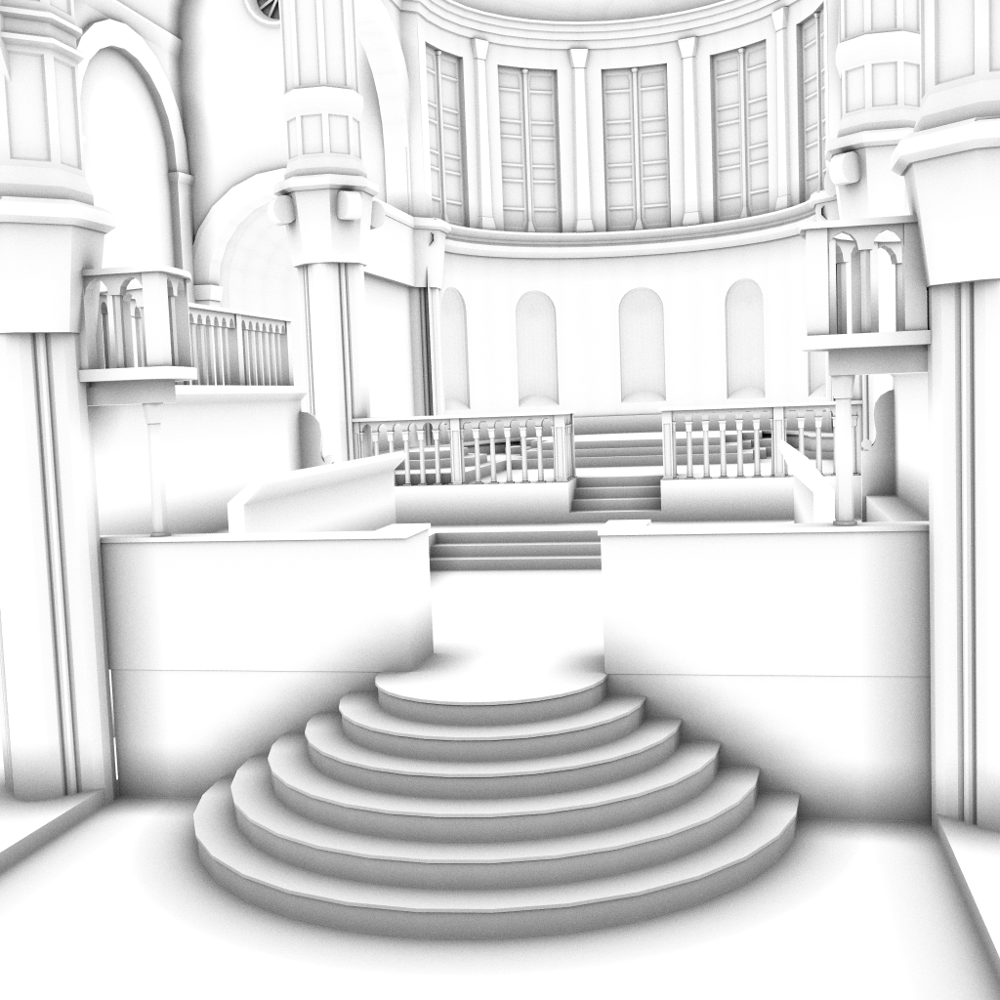

## Ambient Occlusion Benchmark

For our paper [Visionaray: A Cross-Platform Ray Tracing Template Library](https://vis.uni-koeln.de/13925.html), we reported results gathered with our simple AO benchmark program implemented with [Visionaray](https://github.com/szellmann/visionaray). Going to update the results from time to time here for new hardware platforms.

<table border="0">
  <tr>
    <td>
      
    </td>
    <td>
      
    </td>
    <td>
      
    </td>
    <td>
      
    </td>
  </tr>
  <tr>
    <td>Platform</td>
    <td>Conference Room</td>
    <td>Fairy Forest</td>
    <td>Sibenik Cathedral</td>
  </tr>
  <tr>
    <td>NVIDIA GTX 1080Ti</td>
    <td>290.7 (290.9)</td>
    <td>143.4 (143.5)</td>
    <td>288.5 (290.7)</td>
  </tr>
  <tr>
    <td>Intel KNL with 64x4 threads</td>
    <td>254.0 (273.2)</td>
    <td>130.0 (130.4)</td>
    <td>247.7 (268.2)</td>
  </tr>
  <tr>
    <td>NVIDIA GTX 980Ti</td>
    <td>172.9 (228.3)</td>
    <td>73.4 (83.3)</td>
    <td>139.1 (188.5)</td>
  </tr>
  <tr>
    <td>NVIDIA Quadro K6000</td>
    <td>142.4 (189.1)</td>
    <td>63.1 (71.1)</td>
    <td>113.2 (142.9)</td>
  </tr>
  <tr>
    <td>NVIDIA Titan (1st gen, Kepler)</td>
    <td>114.4 (143.3)</td>
    <td>55.5 (56.9)</td>
    <td>81.5 (114.4)</td>
  </tr>
  <tr>
    <td>16-core dual socket Xeon E5-2690</td>
    <td>102.0 (117.0)</td>
    <td>55.0 (57.1)</td>
    <td>94.2 (105.6)</td>
  </tr>
  <tr>
    <td>NVIDIA GTX 970M</td>
    <td>83.6 (107.1)</td>
    <td>32.7 (36.4)</td>
    <td>63.9 (87.9)</td>
  </tr>
  <tr>
    <td>Intel Core i7 6800K, 6x2 threads</td>
    <td>80.1 (89.4)</td>
    <td>40.6 (41.7)</td>
    <td>68.6 (77.8)</td>
  </tr>
  <tr>
    <td>Apple MBP Mid 2014 2.8 GHz Core i7, 4x2 threads</td>
    <td>41.8 (46.2)</td>
    <td>20.8 (21.0)</td>
    <td>34.7 (39.4)</td>
  </tr>
  <tr>
    <td>Nehalem Core i7 920, 2.67 GHz, 4x2 threads</td>
    <td>20.7 (21.9)</td>
    <td>11.4 (11.9)</td>
    <td>15.9 (18.5)</td>
  </tr>
  <tr>
    <td>Raspberry PI3 with ARM NEON</td>
    <td>2.0 (2.3)</td>
    <td>1.2 (1.3)</td>
    <td>1.7 (1.9)</td>
  </tr>
</table>

Results are in Mrays/s, 1024 x 1024 px. images, averaged over 250 runs, 8 AO rays. We report results for the [binned BVH builder](http://www.sci.utah.edu/~wald/Publications/2007/ParallelBVHBuild/fastbuild.pdf), and the [SBVH builder](http://www.nvidia.ca/docs/IO/77714/sbvh.pdf) in parentheses.

A tarball containing the benchmark script can be downloaded from [here](https://github.com/szellmann/szellmann.github.io/blob/master/res/ao_bench.tar.gz). Results for hardware platforms not listed here are highly welcome. Please send those to me (Stefan Zellmann, info (at) szellmann (dot) de), along with the output of `cat /proc/cpuinfo` or sth. similar, and a brief note which benchmark you ran (CUDA, SSE, AVX).

Contributors
------------

Thanks go to:
  - Martin Aumüller for the i7 6800K results
  - Matthias Hellmann for providing the GTX 980Ti and GTX 970M results
